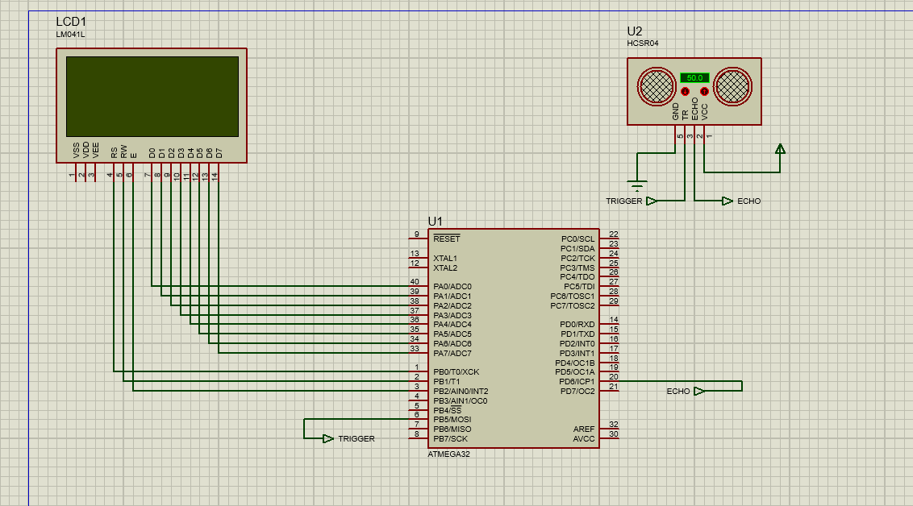

# Mini Project 4 - Distance Measurement System

## Overview
This project implements a distance measurement system using the HC-SR04 ultrasonic sensor and ATmega32 microcontroller. The system measures the distance and displays it on a 4x16 LCD. The design follows a layered architecture model and utilizes various drivers for GPIO, ICU, and LCD.

## System Requirements
1. **Microcontroller:** ATmega32 with 8MHz frequency.
2. **Ultrasonic Sensor:** HC-SR04 for distance measurement.
3. **LCD Display:** 4x16 LCD to display the measured distance.

## Components
- **HC-SR04 Ultrasonic Sensor**
- **ATmega32 Microcontroller**
- **4x16 LCD Display**

## Driver Requirements

### GPIO Driver
- Utilize the GPIO driver as implemented in the course.

### ICU Driver
- Utilize the ICU driver as implemented in the course.
- Configure ICU with frequency F_CPU/8.
- Detect the rising edge as the first edge.
- Initialize ICU and set callback functions inside the `Ultrasonic_init` function.

### LCD Driver
- Use a 4x16 LCD with 8-bit data mode.
- Connect the LCD control and data pins as follows:
  - **RS** → PB0
  - **RW** → Ground
  - **E** → PB1
  - **Data Bus** → All PORTA pins

### Ultrasonic Driver
- Implement a full ultrasonic driver using the ATmega32 ICU driver.
- The ultrasonic driver includes the following functions:

  #### a. `void Ultrasonic_init(void)`
  - **Description:**
    - Initialize the ICU driver as required.
    - Set up the ICU callback function.
    - Configure the trigger pin as an output pin using the GPIO driver.
  - **Inputs:** None
  - **Return:** None

  #### b. `void Ultrasonic_Trigger(void)`
  - **Description:**
    - Send a trigger pulse to the ultrasonic sensor.
  - **Inputs:** None
  - **Return:** None

  #### c. `uint16 Ultrasonic_readDistance(void)`
  - **Description:**
    - Send the trigger pulse using `Ultrasonic_Trigger`.
    - Start measurements with the ICU from this moment.
  - **Inputs:** None
  - **Return:** Measured distance in centimeters.

  #### d. `void Ultrasonic_edgeProcessing(void)`
  - **Description:**
    - Callback function invoked by the ICU driver.
    - Calculate the high time (pulse time) generated by the ultrasonic sensor.
  - **Inputs:** None
  - **Return:** None

## System Design
The system is designed based on a layered architecture model, which includes:
- **GPIO Layer:** Manages general-purpose input/output.
- **ICU Layer:** Handles input capture for measuring pulse duration.
- **LCD Layer:** Controls the display to show the measured distance.
- **Ultrasonic Layer:** Interfaces with the ultrasonic sensor and processes distance measurements.

## Connections
- **HC-SR04:**
  - **VCC** → 5V
  - **GND** → Ground
  - **Trig** → Connected to a GPIO pin
  - **Echo** → Connected to an ICU pin

- **LCD:**
  - **RS** → PB0
  - **RW** → Ground
  - **E** → PB1
  - **Data Pins** → PORTA

## Implementation Notes
- Ensure proper configuration of ICU for accurate pulse width measurement.
- Verify connections and pin configurations to ensure correct functionality of the LCD and ultrasonic sensor.
- Follow the specifications for driver functions to ensure compatibility and functionality.

## Future Enhancements
- Add a graphical representation of distance on the LCD.
- Implement calibration routines to improve measurement accuracy.
- Integrate additional sensors or modules for more comprehensive distance measurement.

