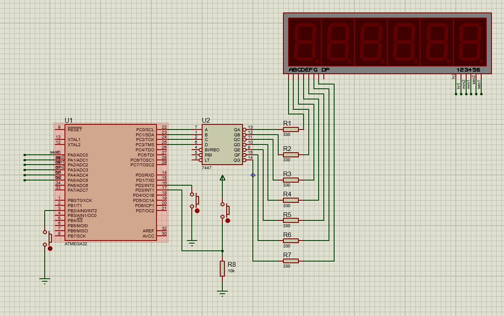

# Stop Watch System

## Overview

This project implements a Stop Watch system using the ATmega32 microcontroller. The system uses Timer1 in CTC mode to count time, displays the time on six multiplexed 7-segment displays, and provides control through external interrupts.

## System Requirements

1. **Microcontroller**: ATmega32 with a frequency of 1 MHz.
2. **Timer Configuration**: Timer1 configured in CTC mode to count the Stop Watch time.
3. **Display**: Six common anode 7-segment displays.
   - **Multiplexing**: Uses multiplexing technique to drive multiple 7-segment displays with one 7447 decoder.
   - **Decoder**: 7447 common anode BCD to 7-segment decoder.
   - **Enable/Disable**: Control the 7-segment displays using NPN BJT transistors.
4. **Port Connections**:
   - **7447 Decoder**: Connected to the first 4 pins of PORTC.
   - **Enable/Disable Pins**: Connected to the first 6 pins of PORTA.
5. **Stop Watch Controls**:
   - **Power-On**: Stop Watch counting starts automatically upon power connection.
   - **Reset**: Triggered by External Interrupt INT0 (falling edge) with a push button and internal pull-up resistor.
   - **Pause**: Triggered by External Interrupt INT1 (rising edge) with a push button and external pull-down resistor.
   - **Resume**: Triggered by External Interrupt INT2 (falling edge) with a push button and internal pull-up resistor.

## Project Structure

1. **Timer1 Configuration**:
   - Configure Timer1 in CTC mode to count time accurately.
   - Use Timer1 to generate interrupts at regular intervals to update the stop watch display.

2. **7-Segment Display**:
   - Implement multiplexing technique to drive six 7-segment displays.
   - Use 7447 decoder to convert binary input to 7-segment display output.
   - Control each display using NPN BJT transistors to switch between displays.

3. **External Interrupts**:
   - **INT0**: For resetting the stop watch (falling edge).
   - **INT1**: For pausing the stop watch (rising edge).
   - **INT2**: For resuming the stop watch (falling edge).

## Connections

- **7447 Decoder**:
  - Connect to PORTC (first 4 pins).
- **7-Segment Displays**:
  - Control enable/disable via PORTA (first 6 pins).

## Getting Started

1. **Hardware Setup**:
   - Connect the 7-segment displays and 7447 decoder as per the multiplexing scheme.
   - Set up the NPN BJT transistors for display control.
   - Wire the push buttons for external interrupts with the appropriate pull-up and pull-down resistors.

2. **Software Configuration**:
   - Initialize Timer1 in CTC mode.
   - Configure external interrupts INT0, INT1, and INT2.
   - Implement display multiplexing and update logic for the 7-segment displays.

3. **Testing**:
   - Power on the system to verify automatic start of the stopwatch.
   - Test reset, pause, and resume functions using the external interrupts.

## References

- **Video Tutorial**: [Stop Watch System Overview](https://youtu.be/emp-musYxII)
- **Datasheets**: Refer to the ATmega32 and 7447 datasheets for detailed specifications and configurations.

## License

This project is licensed under the MIT License - see the [LICENSE](LICENSE) file for details.

## Acknowledgements

Special thanks to the course materials and resources that provided guidance and code snippets used in this project.
